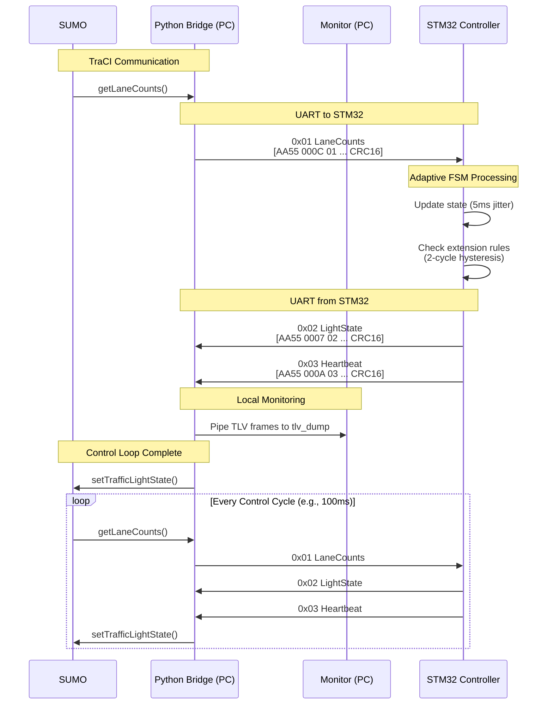

<!-- START doctoc generated TOC please keep comment here to allow auto update -->
<!-- DON'T EDIT THIS SECTION, INSTEAD RE-RUN doctoc TO UPDATE -->

**Table of Contents** _generated with [DocToc](https://github.com/thlorenz/doctoc)_

- [**TLV Protocol Specification v2 (Final)**](#tlv-protocol-specification-v2-final)
  - [**1. Frame Format**](#1-frame-format)
  - [**2. LEN Semantics**](#2-len-semantics)
  - [**3. CRC Specification**](#3-crc-specification)
  - [**4. Message Types**](#4-message-types)
    - [**`0x01 LaneCounts`** (SUMO → STM32)](#0x01-lanecounts-sumo--stm32)
    - [**`0x02 LightState`** (STM32 → SUMO)](#0x02-lightstate-stm32--sumo)
    - [**`0x03 Heartbeat`** (STM32 → SUMO)](#0x03-heartbeat-stm32--sumo)
  - [**5. State Definitions**](#5-state-definitions)
    - [**Traffic Light States:**](#traffic-light-states)
    - [**Decision Reasons:**](#decision-reasons)
    - [**Heartbeat Status Flags:**](#heartbeat-status-flags)
  - [**6. Adaptive Algorithm (FSM Extension Rule)**](#6-adaptive-algorithm-fsm-extension-rule)
  - [**7. Frame Examples**](#7-frame-examples)
  - [**8. High-Level Data Flow**](#8-high-level-data-flow)

<!-- END doctoc generated TOC please keep comment here to allow auto update -->

---

## **TLV Protocol Specification v2 (Final)**

### **1. Frame Format**

```
| SOF 2B = 0xAA55 | LEN 2B (LE) | TYPE 1B | PAYLOAD (LEN-3) | CRC16 2B (LE) |
```

### **2. LEN Semantics**

- `LEN` = bytes from `TYPE` through `CRC` = `payload_len + 3`
- `payload_len` = `LEN - 3`
- **All multi-byte fields are Little-Endian (LE)**
- Maximum frame length: 32 bytes

### **3. CRC Specification**

- **Algorithm**: CRC16-CCITT
- **Polynomial**: 0x1021
- **Initial Value**: 0xFFFF
- **Coverage**: CRC covers `LEN | TYPE | PAYLOAD` (does NOT include SOF)
- **Final XOR**: 0x0000
- **Recovery**: Invalid LEN or CRC → advance 1 byte and re-seek SOF

### **4. Message Types**

#### **`0x01 LaneCounts`** (SUMO → STM32)

```c
uint32 ts_sec;          // LE (UNIX seconds)
uint8 junction_type;    // 0=X-junction, 1=Y-junction
uint8 n;               // North approach vehicle count (0-255)
uint8 s;               // South approach vehicle count (0-255)
uint8 e;               // East approach vehicle count (0-255)
uint8 w;               // West approach vehicle count (0-255)
```

**Total payload**: 9 bytes → `LEN = 12 (0x000C)`

#### **`0x02 LightState`** (STM32 → SUMO)

```c
uint8 current_state;    // 0=NS_GREEN, 1=NS_YELLOW, 2=EW_GREEN, 3=EW_YELLOW, 4=ALL_RED
uint8 decision_reason;  // 0=fixed_time, 1=adaptive_extension, 2=emergency, 3=failsafe
uint16 phase_duration;  // LE, in 100ms units (e.g., 80 = 8.0s)
```

**Total payload**: 4 bytes → `LEN = 7 (0x0007)`

#### **`0x03 Heartbeat`** (STM32 → SUMO)

```c
uint32 uptime_ms;       // LE, system uptime in milliseconds
uint16 seq;             // LE, increments every heartbeat
uint8 status;           // bitfield flags (see below)
```

**Total payload**: 7 bytes → `LEN = 10 (0x000A)`

### **5. State Definitions**

#### **Traffic Light States:**

```c
#define NS_GREEN     0  // North-South flow green (8s min, 25s max)
#define NS_YELLOW    1  // North-South flow yellow (3s fixed)
#define EW_GREEN     2  // East-West flow green (8s min, 25s max)
#define EW_YELLOW    3  // East-West flow yellow (3s fixed)
#define ALL_RED      4  // All directions red (1s fixed)
```

#### **Decision Reasons:**

```c
#define FIXED_TIME          0  // Fixed timing schedule
#define ADAPTIVE_EXTENSION  1  // Extended due to vehicle detection
#define EMERGENCY           2  // Emergency vehicle or manual override
#define FAILSAFE            3  // System fallback mode
```

#### **Heartbeat Status Flags:**

```c
#define HB_LINK_OK      (1u<<0)  // Communication link active
#define HB_FAILSAFE     (1u<<1)  // System in failsafe mode
#define HB_EMERGENCY    (1u<<2)  // Emergency override active
#define HB_CRC_ERR_SEEN (1u<<3)  // CRC errors detected recently
```

### **6. Adaptive Algorithm (FSM Extension Rule)**

**Variables:**

- `elapsed_green_ms` - Time spent in current GREEN phase
- `extend_votes` (0..2) - Hysteresis counter
- `EXT_STEP_MS = 4000` - Extension step size
- `MIN_GREEN_MS = 8000` - Minimum green time
- `MAX_GREEN_MS = 25000` - Maximum green time

**Per LaneCounts update:**

```c
bool cond = (opposite_queue >= current_queue + 3);

if (cond) extend_votes++;
else extend_votes = 0;

if (extend_votes > 2) extend_votes = 2;  // saturate

bool should_extend = (extend_votes >= 2) &&
                     (elapsed_green_ms + EXT_STEP_MS <= MAX_GREEN_MS);
```

**Transitions:**

- After `MIN_GREEN_MS`, if `should_extend` → extend green by 4s
- Hard cap at `MAX_GREEN_MS` → force transition to Yellow
- Extensions occur in 4s steps with 2-cycle hysteresis

### **7. Frame Examples**

- **LaneCounts**: `AA55 000C 01 [9-byte payload] [CRC16]`
- **LightState**: `AA55 0007 02 [4-byte payload] [CRC16]`
- **Heartbeat**: `AA55 000A 03 [7-byte payload] [CRC16]`

### **8. High-Level Data Flow**


